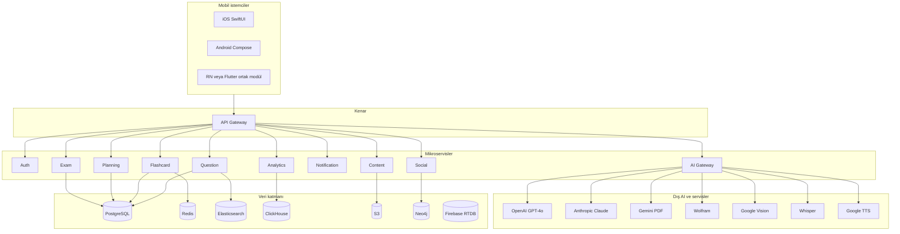

# ZekaAkademi — Uygulama Mimari Taslağı

Bu belge, **Zeka Akademi.pdf** (Yapay Zeka Destekli Akıllı Eğitim Platformu — Kapsamlı Mobil Uygulama Tasarım ve Geliştirme Rehberi) ile **birebir uyumlu** olacak şekilde hazırlanmıştır. Hedef sınavlar: LGS, YKS, KPSS, ALES, DGS ve ÖSYM sınavları. Ölçek hedefi: 15+ modül, 60+ ekran, 100+ özellik.

---

## 1. Stratejik çerçeve ve ürün konumu

### 1.1 Vizyon (belge 1.1)

- **Ürün**: Türkiye sınav ekosistemine yönelik, yapay zekâ ile desteklenen **kapsamlı mobil öğrenme platformu**.
- **Konumlandırma**: MEBİ’nin resmî içerik/ölçeği ile Kunduz tarzı soru çözüm talebini birleştiren ihtiyacı karşılar; tek uygulamada **tüm sınav türleri + gelişmiş AI** sunmayı hedefler.

### 1.2 Hedef kitle segmentleri (belge 1.2)

Mimari ve veri modeli aşağıdaki segmentlere göre **özellik bayrakları**, **içerik filtreleri** ve **analitik boyutları** taşımalıdır:

| Segment | Yaş / profil | Birincil ihtiyaç | Tahmini büyüklük (belge) |
|--------|----------------|------------------|-------------------------|
| YKS | 9–12. sınıf (15–18) | TYT/AYT, deneme | ~2.5M |
| LGS | 7–8. sınıf (12–14) | Soru bankası, müfredat | ~1.3M |
| KPSS | Üniversite mezunu (22–35) | GY/GK + ÖABT | ~1.8M |
| ALES/DGS | Lisans mezunu | Sayısal/sözel akıl yürütme | ~600K |
| Üniversite öğrencisi | 18–25 | Vize/final, not | ~3M |
| Öğretmen | 25–45 | Soru bankası, materyal üretimi | ~900K |

### 1.3 Rekabet farkları (belge 1.3)

Mimari kararlar şu farkları desteklemelidir: **çoklu sınav**, **hibrit AI + uzman (ileride)**, **FSRS + Türk müfredatı odaklı flash kart**, **sınav odaklı gamification**, **bireysel + kurumsal** erişim.

### 1.4 Özellik matrisi — modül önceliği ve MVP (belge 1.4, sayfa 3–4)

| # | Modül | AI derinliği | Öncelik | MVP’de? |
|---|--------|--------------|---------|---------|
| 1 | AI destekli planlama | GPT-4o + müfredat analizi | Kritik | Evet |
| 2 | AI soru çözme | OCR + LLM + Sokratik | Kritik | Evet |
| 3 | Soru bankası | NLP kategorizasyon | Kritik | Evet |
| 4 | AI flash kart | FSRS + NLP üretim | Yüksek | Evet |
| 5 | AI özet/sunum | RAG + LLM | Yüksek | Hayır (V2 roadmap) |
| 6 | Pomodoro/odak | Davranışsal analitik | Yüksek | Evet |
| 7 | Bilgi yarışması | NLP + soru üretimi | Orta | Hayır (V1.5) |
| 8 | Deneme sınavı | Adaptif test motoru | Kritik | Evet |
| 9 | Boşluk doldurma | NLP cloze | Orta | Hayır (V1.5) |
| 10 | Sınav geri sayım | NLP + takvim | Yüksek | Evet |
| 11 | Müfredat tespiti | Document AI + NER | Yüksek | Evet |
| 12 | Sosyal/topluluk | Öneri sistemi | Orta | Hayır (V1.5) |
| 13 | İstatistik/analitik | ML performans analizi | Yüksek | Evet |
| 14 | Soru ekleme | İçerik moderasyon AI | Orta | Hayır |
| 15 | AI koçluk botu | Sokratik GPT-4o | Yüksek | Hayır (V2) |

**Mimari çıkarım**: MVP’de servis sınırları **1–4, 6, 8, 10, 11, 13** için tam kapasite; **5, 7, 9, 12, 14, 15** için ya stub/feature-flag ya da ayrı release train.

---

## 2. İstemci (mobil) mimarisi — onboarding’dan panele

### 2.1 Kısıtlar (belge Bölüm 2)

- Onboarding: **en fazla 7 ekran**, **3 dakikayı aşmamalı**.

### 2.2 Ekran akışları ve teknik gereksinimler

| Ekran | İşlev | Mimari notlar |
|-------|--------|----------------|
| **1 — Splash** | 2.5 sn animasyon; config yükleme; token kontrolü; bağlantı kontrolü | Uygulama bootstrap: remote config, auth state, connectivity. Token geçerli → ana panel; yok → karşılama. Offline → uyarı + önbellekli içerik. |
| **2 — Karşılama** | 3 sayfa swipe; nokta göstergesi; son sayfada “Hemen Başla” / “Giriş Yap” | İçerik CMS veya remote config ile yönetilebilir. |
| **3 — Kayıt/Giriş** | E-posta+şifre→OTP; Google OAuth; Apple Sign-In; telefon OTP; misafir (3 deneme) | **Auth Service**; Apple zorunlu iOS; KVKK onayı e-posta akışında zorunlu; misafir için cihaz kimliği + kota tablosu. |
| **4 — Profil Step 1/4** | Ad-soyad zorunlu; doğum tarihi; il/ilçe opsiyonel; cinsiyet opsiyonel (KVKK metni) | **User Profile** servisi; “Şimdi değil” ile kısmi profil. |
| **5 — Sınav seçimi Step 2/4** | Kartlar: YKS/LGS/KPSS/ALES/DGS/Üniversite/ Diğer; çoklu seçim; YKS alt: SAY/EA/SÖZ/DİL; hedef net/puan opsiyonel | **ExamContext** aggregate: seçimler tüm kişiselleştirmeyi tetikler; event: `exam_targets.updated`. |
| **6 — Seviye testi Step 3/4** | 10 soru; 60 sn/soru; adaptif zorluk; ders bazlı profil; atlama → varsayılan seviye | **Assessment Service**: IRT/adaptif basit kural motoru veya hazır soru havuzu + zorluk etiketi. |
| **7 — Kişiselleştirme Step 4/4** | Sınav tarihi; günlük kapasite slider 30 dk–8 saat; zayıf konular; çalışma saati tercihi; 3 sn “plan hazırlanıyor”; haftalık önizleme → “Planı Başlat” | **Planning Service** + async job; sonuç **Calendar/Task** modeline yazılır. |

### 2.3 İstemci teknoloji seçenekleri (belge 16.1.1)

- **iOS**: Swift + SwiftUI  
- **Android**: Kotlin + Jetpack Compose  
- **Ortak kod (~%60)**: React Native veya Flutter (ürün kararı)  
- **State**: Redux Toolkit veya Zustand  
- **Offline**: SQLite + AsyncStorage (veya platform eşdeğeri)  
- **Push**: FCM + APNs  

**Önerilen katmanlama**: feature modülleri (`onboarding`, `dashboard`, `study`, `exam`, `stats`, `profile`) + `core/network`, `core/storage`, `core/auth`, `core/analytics`.

---

## 3. Ana panel ve navigasyon (belge Bölüm 3)

### 3.1 Dashboard bileşenleri

1. **Durum çubuğu**: selamlama (saate göre), bugünkü hedef %, bildirim, streak.  
2. **Sınav geri sayım widget**: birincil + ikincil sınav chip.  
3. **Bugünkü görevler**: 3–7 görev; türler: konu, soru, flash kart, deneme; tamamlanınca konfeti.  
4. **Quick actions (6’lı grid)**: AI Soru Çöz, Flash Kart, Deneme, AI Plan, Soru Bankası, Bilgi Yarışması (yarışma MVP dışıysa disabled veya “yakında”).  
5. **Son aktivite + AI öneriler + liderlik sırası** (gamification servisine bağlı).

### 3.2 Alt navigasyon (4 tab + badge kuralları)

| Tab | İçerik | Badge |
|-----|--------|--------|
| Ana Sayfa | Dashboard, günlük plan, haber | Tamamlanmayan görev |
| Çalış | Soru, flash kart, Pomodoro | Eksik görev |
| Sınav | Deneme, soru bankası, yarışma | Aktif sınav |
| İstatistik | Performans, rapor, rozet | Yeni rozet |
| Profil | Ayarlar, abonelik, hedefler | Eksik profil |

### 3.3 Drawer (Premium / ek özellikler)

- AI Koç konuşma (Premium+)  
- Öğretmen modu (Premium)  
- Gruplar / arkadaşlar  
- İndirilen içerikler (offline)  
- Destek, abonelik  

**Mimari**: `EntitlementService` (abonelik katmanı) + feature flags; drawer öğeleri sunucu konfigürasyonu ile kontrol edilebilir.

---

## 4. AI destekli planlama modülü (belge Bölüm 4)

### 4.1 Veri kaynakları ve ağırlıklar

| Kaynak | Veri | Güncelleme | Ağırlık |
|--------|------|------------|---------|
| Seviye testi | Konu yeterlilik 0–100 | Sınav sonrası | %25 |
| Performans geçmişi | Doğru/yanlış, süre | Her oturum | %30 |
| Müfredat durumu | İşlenen/işlenmeyen | Günlük | %25 |
| Sınav takvimi | Kalan gün, öncelik | Anlık | %20 |

### 4.2 Plan oluşturma akışı (servis sırası)

1. `PlanningOrchestrator` kullanıcı tetikler veya onboarding tamamlar.  
2. `UserProfile`, `Assessment`, `CurriculumProgress`, `ExamCalendar` verileri toplanır.  
3. Yapılandırılmış prompt ile **GPT-4o** (belge) → **JSON şeması** ile haftalık plan.  
4. Plan **interaktif takvim** API’sine yazılır.  
5. İstemci sürükle-bırak ile günceller → sunucuda çakışma çözümü.  
6. Onay → görevler ve bildirim kuyruğuna işlenir.

### 4.3 Haftalık plan UI — backend karşılıkları

- Hafta seçici, görünüm (hafta/gün/ay): `GET /plans?week=…&view=…`  
- Renk kodlu ders slotları: `task.subject_id → theme`  
- Sürükle-bırak: `PATCH /tasks/{id}` (start, end, day)  
- “AI ile yeniden planla”: `POST /plans/regenerate` (Celery job)

### 4.4 Akıllı yeniden zamanlama (Reclaim benzeri)

Olaylar: görev atlama, sınav yaklaşması, hafta sonu telafi, “hastalık” bildirimi.  
**Bileşen**: `ReschedulingPolicyEngine` (kurallar + LLM önerisi opsiyonel); önerilen slotlar `AvailabilityService` veya basit boş slot algoritması ile.

### 4.5 Plan analizi

Metrikler: haftalık tamamlanma, ders dağılımı, hedef vs gerçek süre, streak, özet metin.  
**Analytics Service** + özet için hafif LLM veya template.

---

## 5. AI soru çözme ve soru bankası (belge Bölüm 5)

### 5.1 Soru giriş kanalları ve boru hattı

| Giriş | Altyapı | Not |
|-------|---------|-----|
| Kamera | Tesseract + Google Vision (belge) | Ön işleme pipeline |
| Galeri | OCR + preprocessing | |
| El yazısı | CNN tabanlı (özel model veya üçüncü parti) | Düşük doğruluk; kullanıcıya uyarı |
| Metin | Doğrudan LLM | |
| Ses | Whisper → LLM | |

### 5.2 Çözüm motoru adımları (belge 5.1.2)

1. Görüntü/metin → ön işleme (kontrast, rotate, denoise)  
2. OCR → metin/formül  
3. Soru tipi sınıflandırma (Matematik/Fen/Sözel/Yabancı/Diğer)  
4. Model yönlendirme: Matematik → **Wolfram + GPT**; Fen → GPT-4o; Sözel → Claude (belge)  
5. Sokratik mod: ipuçusu; standart: adım adım çözüm  
6. Okunurluk skoru; gerekirse yeniden ifade  
7. Benzer sorular **Question Service** + vektör/ES araması  

**Mimari**: `AI Gateway` içinde **router** + **policy** (Sokratik, sınav modunda AI kapatma — belge 18.2).

### 5.3 Soru bankası veri modeli (belge 5.2.1)

Zorunlu alanlar: `question_id (UUID)`, `sınav_türü`, `ders`, `konu`, `alt_konu`, `müfredat_yılı`, `zorluk (1–5)`, `soru_tipi`, `kaynak`, `çözüm_süresi_ort`, `doğru_cevap_oranı`, `görsel_var_mı`.

**Depolama**: PostgreSQL (ilişkisel + JSONB esnek alanlar); **Elasticsearch** tam metin ve doğal dil arama; medya S3.

### 5.4 Soru çözüm modu (istemci + API)

- Anlık geri bildirim, opsiyonel süre, “Önce düşün” 30 sn kilit → sunucu `answer_submitted_at` ile doğrulama veya istemci güveni (MVP) + anti-cheat için deneme modunda farklı politika.

### 5.5 Kullanıcı soru ekleme (belge 5.2.4 — modül hayır ama akış tanımlı)

Adımlar: içerik → şıklar → çözüm → etiketleme → **AI moderasyon** → **topluluk onayı (3+)** → yayın.  
**Servisler**: Content Service, Moderation (LLM + kurallar), Community vote tablosu.  
**ZekaPuan**: onay başına +50 (belge 9.2.1 ile uyumlu).

---

## 6. AI flash kart sistemi (belge Bölüm 6)

### 6.1 Üretim kaynakları (Flashcard Service + Content + AI Gateway)

| Kaynak | İşlem | AI |
|--------|--------|-----|
| PDF/belge | Anahtar kavram | GPT-4o + NER |
| Fotoğraf | OCR → NLP | Vision + GPT |
| URL | Scraping → özet | RAG + özet |
| Ses | Whisper → özet | Whisper + GPT-4o |
| Video (YouTube) | Transcript | YouTube transcript + GPT |
| Manuel | Kullanıcı | AI tamamlama |
| Soru bankası | Şablon | Template + GPT |

### 6.2 Kart tipleri

- Standart ön/arka + 3D flip  
- Cloze (çoklu boşluk)  
- Görsel oklüzyon (etiket/kutu)  
- Sesli kart (Google TTS Türkçe; yabancı dil telaffuzu; kullanıcı kaydı)

### 6.3 FSRS (belge 6.3)

- SM-2’ye göre daha az tekrar iddiası; 17 parametre; min 1000 tekrar sonrası kalibrasyon.  
- Derecelendirme: 1–5 (Yeniden … Çok Kolay).  
**Uygulama**: Python **Flashcard Service** + Redis (sıra, günlük kuyruk) + PostgreSQL (kart durumu).

### 6.4 Çalışma ve deste yönetimi

- Çalışma ekranı: deste adı, X/Y, FSRS butonları, bugün kalan, tahmini süre.  
- Deste listesi: sınav modu, paylaşım, **AI ile optimize** (benzer kart birleştirme).

---

## 7. AI özet ve sunum modülü (belge Bölüm 7 — V2)

### 7.1 Giriş limitleri ve çıktılar

PDF 50MB, Word 20MB, PPTX 30MB, ses 100MB/90dk, YouTube URL, görsel 10MB, metin 50K karakter. Çıktı: özet / sunum / flash kart / transkript / sorular.

### 7.2 Sunum üretimi

Slayt sayısı, şablon (Akademik/Minimal/Renkli/Karanlık), konuşmacı notları, export PPTX/PDF, **kaynak doğrulama zorunluluğu** (hallüsinasyon riski).

**Mimari**: Content Service (async işleme, kuyruk), RAG deposu, ayrı **PresentationWorker**; Premium kota (belge 17.2).

---

## 8. Pomodoro ve odak (belge Bölüm 8)

### 8.1 Temel ve adaptif Pomodoro

- Varsayılan 25/5; özelleştirilebilir 15–90 / 5–30.  
- AI öneri: geçmiş veriye göre süre; ders zorluğuna göre öneri; verimli saat dilimi; 90 dk üzeri mola uyarısı.

**Servis**: Analytics’ten özellik çıkarımı + Planning ile entegrasyon; istemci timer.

### 8.2 Uygulama engelleme

OS seviyesinde (Screen Time API / Digital Wellbeing) veya yardımcı erişim politikaları — ürün/hukuk incelemesi gerekir. Mimari: `FocusSession` kaydı + bypass sayacı (3 deneme → 30 dk kilit — belge).

### 8.3 Sanal çalışma odaları (belge 8.2.2 — V2 roadmap)

**Firebase RTDB** (belge 16.1.4) canlı yarışma/odalar için; ortak Pomodoro, reaction, seri rozeti.

### 8.4 Odak istatistikleri

Ders bazlı süre, haftalık ısı haritası, en verimli saatler, tamamlama oranı → **Analytics Service** + ClickHouse.

---

## 9. Bilgi yarışmaları ve gamification (belge Bölüm 9)

### 9.1 Yarışma formatları

1v1 düello, grup (2–8), haftalık turnuva, hızlı quiz, akıl yarışması (30 soru/30 dk).  
**Servis**: Social/Exam ile kesişen **Matchmaking** + **GameSession**; AI ile soru üretimi için AI Gateway.

### 9.2 ZekaPuan, seviye, rozet, liderlik

- XP tablosu (belge 9.2.1) event-driven: `question.correct`, `flashcard.reviewed`, `pomodoro.completed`, vb.  
- 50 seviye / 500 XP kademe; isimlendirme kademeleri belgedeki gibi.  
- 50+ rozet; gizli ve görev bazlı.  
- Liderlik: haftalık/aylık/all-time; filtreler Türkiye/şehir/arkadaş/sınıf/sınav.

**Depolama**: PostgreSQL (özet tablolar) + Redis (sıralama) + periyodik materialization.

---

## 10. Zamanlanmış deneme sınavları (belge Bölüm 10)

### 10.1 Türler ve süreler

TYT tam (135 dk/120), AYT alan (180/80), LGS (100/90), KPSS (120/120), mini deneme, hata tekrar, adaptif sınav.

### 10.2 Başlatma akışı

Sınav türü → kaynak (ÖSYM/karma/özgün) → konu filtresi → zorluk → bilgi ekranı → 3-2-1 → sınav.

### 10.3 Sınav ekranı

Üst: X/Y gezgin, geri sayım (son 10 dk kırmızı), ders bazlı süre (varsa), bırak.  
Orta: metin/görsel zoom, 4–5 şık, boş bırak, işaretle.  
Alt: önceki/sonraki, grid (boş/cevaplı/işaretli renk kodu).

### 10.4 Sonuç ve analitik

Net/puan, önceki deneme karşılaştırması, tahmini sıralama, ders özeti, konu bazlı, zaman analizi, hata pattern, AI öğrenme önerisi, soru bazlı inceleme.

**Exam Service**: oturum state makinesi, süre senkronu, cevap patch, bitişte olay `exam.completed` → Analytics + Planning tetikleri.

---

## 11. Boşluk doldurma kartları (belge Bölüm 11 — V1.5)

NLP pipeline: NER, TF-IDF, zorluk, çeldirici üretimi, çıktı MCQ veya yazılı.  
UI modları: MCQ, yazılı (semantik benzerlik), sürükle-bırak, ipucu, skor + AI öneri.

**Servis**: `ClozeService` (Python) veya AI Gateway alt modülü; soru kaydı Question Service ile ilişkilendirilebilir.

---

## 12. Sınav geri sayım ve takvim (belge Bölüm 12)

### 12.1 ÖSYM/MEB entegrasyonları

Belgedeki tabloya göre: YKS, LGS, KPSS, ALES, DGS, EKPSS, YDUS/TUS/DUS — **ÖSYM API / MEB veri** ile anlık güncelleme; üniversite vize/final kullanıcı eklemesi.

**Servis**: `ExamCalendarService` + harici connector katmanı; widget verisi için **push + background refresh**.

### 12.2 Widget boyutları

Küçük 2x1, orta 4x2, büyük 4x4 — native widget extension’lar; paylaşılan veri: App Group / SharedPreferences.

### 12.3 Müfredat PDF → takvim (belge 12.2)

Akış: yükleme → layout analizi (Gemini/Claude) → NER → yarıyıl çıkarımı → onay UI → Google/Apple Calendar API.  
**Kritik**: “iptal” ayrıştırması; her etkinlik kullanıcı onayı (belge).

---

## 13. Müfredat tespiti ve kişiselleştirme (belge Bölüm 13)

### 13.1 Müfredat veri yapısı

Sınav türü, ders, ana konu, alt konular, kazanım, ağırlık (% net), zorluk dağılımı.

### 13.2 Konu ağacı

Hiyerarşi; her düğümde kazanım sayısı ve kişisel ilerleme %; renk: kırmızı/sarı/yeşil; “Bugün çalış” → soru modu.

### 13.3 Knowledge graph (kullanıcı)

Konu yeterlilik 0–100: soru performansı, FSRS, deneme, zaman kalıbı.

### 13.4 AI koçluk mesajları (günlük)

Kural + LLM şablonları; tetikleyiciler analitik olaylarından. Premium+ kota (belge 17.2).

---

## 14. Sosyal ve topluluk (belge Bölüm 14 — V1.5+)

- Arkadaş: arama, haftalık puan, 1v1 davet, streak görünürlüğü, deste paylaşımı.  
- Sınıf/grup: öğretmen sınıf, davet kodu, ödev, performans panosu, sınıf soru bankası, duyuru, puan.  
- Discover: topluluk desteleri, AI öneri, günün sorusu, başarı hikayeleri.

**Social Service** + **Neo4j** (belge) ilişki grafiği; feed için ES veya PostgreSQL cursor pagination.

---

## 15. İstatistik ve performans analitiği (belge Bölüm 15)

### 15.1 Dashboard metrikleri

Toplam süre, çözülen soru (ders dağılımı), doğruluk halkası, flash kart tekrar takvimi, streak, son 10 deneme trendi.

### 15.2 Derin analiz

Konu ısı haritası, top 10 hata konusu, zaman verimliliği, tahminsel “sınav günü net” (XGBoost/LSTM — belge 16.1.3), anonim kıyas.

### 15.3 Haftalık rapor

Pazar akşamı push; içerik özeti; paylaşım.

**Analytics Service** + ClickHouse olay şeması: `events` (user_id hash, event_type, properties, ts).

---

## 16. Teknik mimari — sistem görünümü (belge Bölüm 16 genişletilmiş)

### 16.1 Mantıksal mikroservisler

| Servis | Teknoloji | Sorumluluk |
|--------|-----------|------------|
| Auth | Node.js + JWT | Kayıt, OTP, OAuth, oturum, misafir kota |
| AI Gateway | Python + FastAPI | OpenAI/Anthropic/Wolfram proxy, rate limit, router |
| Question | Node.js + PostgreSQL | Soru CRUD, filtre, arama koordinasyonu |
| Flashcard | Python + Redis | FSRS, deste, tekrar kuyruğu |
| Planning | Python + Celery | Plan üretimi, yeniden plan, takvim |
| Analytics | Python + ClickHouse | Olaylar, raporlar, ML feature store (evrimsel) |
| Notification | Node.js + Bull | Push, e-posta, SMS |
| Content | Node.js + S3 | Medya, async işleme, transcode |
| Exam | Node.js + PostgreSQL | Deneme oturumu, zamanlayıcı, sonuç |
| Social | Node.js + Neo4j | Arkadaş, grup, feed (hibrit) |

**API Gateway**: tek giriş (REST/gRPC), JWT doğrulama, throttling, WAF.

### 16.2 AI/ML görev haritası (belge 16.1.3)

| Görev | Model/API |
|-------|-----------|
| Genel soru çözme | GPT-4o |
| Cebirsel matematik | Wolfram Alpha |
| OCR/görsel | Google Vision |
| Flash kart üretimi | Claude 3.5 Sonnet |
| Müfredat PDF | Gemini 1.5 Pro |
| Ses | Whisper |
| TTS | Google TTS (TR) |
| FSRS | Özel ML + istatistiksel motor |
| Performans tahmini | XGBoost/LSTM |

### 16.3 Veri depoları (belge 16.1.4)

| Depo | Kullanım |
|------|----------|
| PostgreSQL | Kullanıcı, soru, kart, sınav, plan, ekonomi |
| Redis | Oturum, önbellek, sıralama, FSRS kuyruğu |
| Elasticsearch | Soru ve içerik arama |
| ClickHouse | Analitik olayları |
| S3 | Dosyalar |
| Neo4j | Sosyal graf (V1.5+) |
| Firebase RTDB | Canlı oda/yarışma (V2) |

### 16.4 Senkronizasyon ve olaylar

- Domain olayları: `UserRegistered`, `ExamTargetSet`, `QuestionAnswered`, `FlashcardReviewed`, `PlanApproved`, `ExamCompleted`.  
- **Message bus** (Kafka/RabbitMQ): Analytics tüketicisi, bildirim tüketicisi, gamification tüketicisi.

### 16.5 Güvenlik

- Tüm AI çağrıları gateway üzerinden; API anahtarları mobilde yok.  
- Sınav modunda AI ve dış yardım politikası (belge 18.2).  
- KVKK: rıza logları, silme iş akışı, veri dışa aktarma job’ı.

---

## 17. Monetizasyon mimarisi (belge Bölüm 17)

### 17.1 Planlar

Ücretsiz, Starter (₺49/₺399), Premium (₺99/₺799), Premium+ (₺149/₺1.199), Kurumsal teklif.

### 17.2 Kota motoru (sunucu tarafı zorunlu)

| Özellik | Ücretsiz | Starter | Premium | Premium+ |
|---------|----------|---------|---------|----------|
| Günlük soru | 5 | 50 | ∞ | ∞ |
| AI çözüm kalitesi | Temel | Standart | Gelişmiş | Sokratik koç |
| Flash kart | 50 | 500 | ∞ | ∞ |
| Deneme | 1/ay | 5/ay | ∞ | ∞ |
| AI planlama | Temel | Haftalık | Tam | Tam |
| Boşluk doldurma | Hayır | Evet | Evet | Evet |
| Sunum | Hayır | Hayır | 3/ay | ∞ |
| AI koç mesajı | Hayır | Hayır | Hayır | 30/gün |
| Offline | Hayır | 1GB | 5GB | 20GB |
| Reklam | Var | Yok | Yok | Yok |

**Uygulama**: `SubscriptionService` (StoreKit/Play Billing webhook) + `QuotaService` her kritik endpoint’te (Question, AI solve, Flashcard create, Exam start, Summary job).

---

## 18. KVKK ve etik uyum — mimari kontroller (belge Bölüm 18)

- Açık rıza ve amaç bildirimi (onboarding).  
- Minimizasyon: profil alanları opsiyonel ayrı.  
- Silme: 30 gün içinde tüm veriler — cascade job + S3 object delete.  
- Taşınabilirlik: export worker (JSON/CSV).  
- 13 yaş altı: ebeveyn onayı akışı ve kısıtlı özellikler.  
- Yerelleştirme: TR kullanıcı verisi TR/EU bölgesi (Hetzner TR / AWS eu-central-1).  
- Akademik dürüstlük: Sokratik varsayılan önerisi; uyarı metinleri; öğretmen kısıtı; sınav modunda AI kapalı.  
- Hallüsinasyon: Wolfram çapraz kontrol; RAG zorunluluğu; güven skoru; 👎 geri bildirim pipeline’ı; kritik alan banner’ları.

---

## 19. Roadmap ile hizalama (belge Ek)

| Faz | Odak |
|-----|------|
| MVP (v0.1) | Soru bankası, AI çözüm, flash kart, Pomodoro, basit plan, deneme |
| V1.0 | Tam AI planlama, müfredat tespiti, geri sayım, istatistik, temel gamification |
| V1.5 | Yarışmalar, boşluk doldurma, öğretmen modu, sosyal |
| V2.0 | Özet/sunum, koçluk botu, gelişmiş analitik, sanal odalar |
| V3.0 | Biyometrik odak, AR/VR, kurumsal platform, API marketplace |

---

## 20. Özet mimari diyagram (referans)

---

## 21. Sonuç

Bu taslak; **Zeka Akademi** rehberindeki vizyon, hedef kitle, 15 modülün işlevleri, ekran/akış detayları, teknik stack, veri depoları, monetizasyon kotları, KVKK/etik gereksinimleri ve yol haritası ile **uyumlu** bir **uygulama ve backend mimarisi** önerisidir. Uygulama ekibi, her modül için bu belgeden **API sözleşmeleri**, **olay şemaları** ve **veri tabloları** türeterek sprint planına dökebilir.
